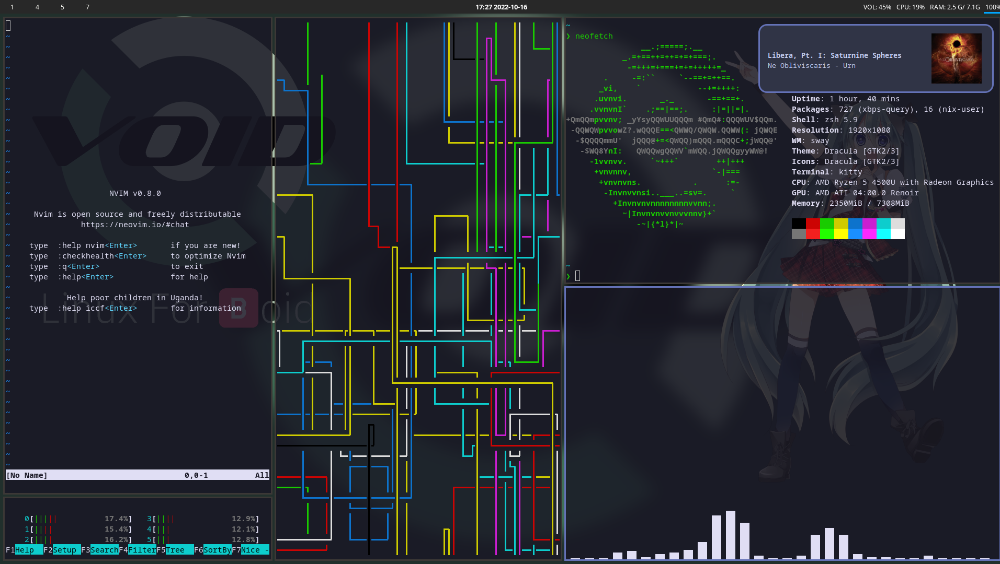

# dotfiles

These are the dotfiles from when I was using Void linux. Will get a commit when there is something worth committing.

- Window Manager: [Sway](https://github.com/swaywm/sway)
- Bar: [Waybar](https://github.com/Alexays/Waybar)
- Launcher [Wofi](https://hg.sr.ht/~scoopta/wofi)
- Terminal Emulator: [kitty](https://github.com/kovidgoyal/kitty)
- Notifacations: [mako](https://github.com/emersion/mako)